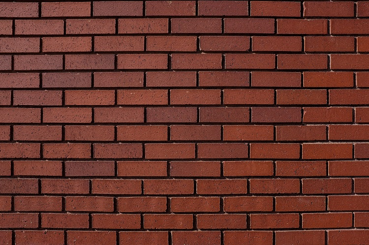
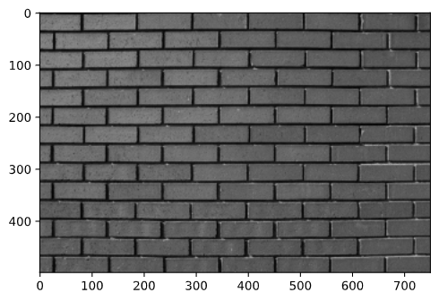
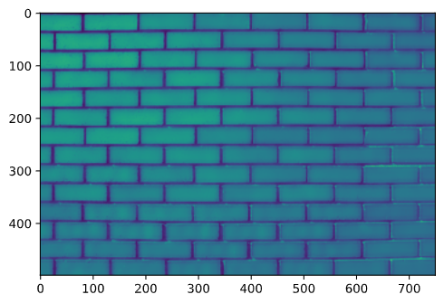
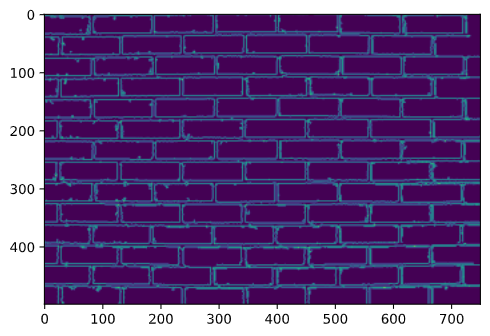
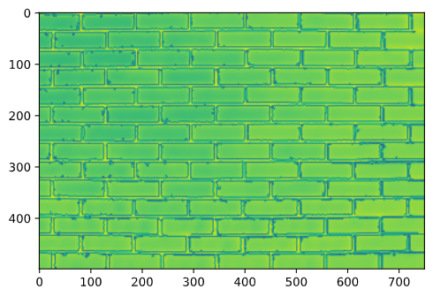
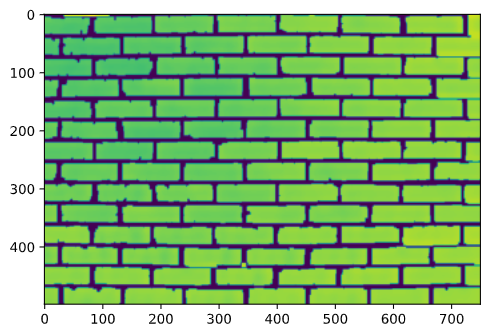

# brick-detection-and-counting

## Getting Started
### Conda (Recommended)

```bash
conda env create -f conda-cpu.yml
conda activate yolov4-cpu
```
### Pip
```bash
# TensorFlow CPU
pip install -r requirements.txt
```

## Abstract
The major purpose of this project is to count the number of bricks(including broken and distorted) from the given image which contains either pile of bricks of the brick fitted in a wall with maximum accuracy and minimum error rate.

## Proposed Methodology

We implemented the above goal in `openCV` and `python`.

#### Steps:
1. Read the image from images directory.

2. Convert the image to **[gray-scale](https://docs.opencv.org/3.4/d8/d01/group__imgproc__color__conversions.html#gga4e0972be5de079fed4e3a10e24ef5ef0a353a4b8db9040165db4dacb5bcefb6ea)** which will be handy in further processing of the image.

3. Use a **[bilateral filter](http://people.csail.mit.edu/sparis/bf_course/)** in order to remove noise while **preserving the edges** of the bricks which is much needed in correct identification of various bricks.

4. Apply **Canny edge detector along with L2 gradient** for hysteresis threshold.

5. Apply local threshold that considers some **neighborhood** pixels rather than global quantification for better analysis of the image.
6. For better sharpness and visibility of the edges to better separate one brick from another in a pile we apply not to the image obtained from **canny edge detector**.
7. Take **bitwise and** of image obtained in **step 5** and **step 6**.

8. This was one of the most challenging step in the project since the bricks which are very closely packed, it is very difficult to count them as a single unit. Therefore, it is very important to open their connections. For this reason we applied **morphological operations.**
   8.1. Create a structuring element and choose a proper kernel size according to the input image.
   8.2. Apply **[morphologyEx](https://opencv-python-tutroals.readthedocs.io/en/latest/py_tutorials/py_imgproc/py_morphological_ops/py_morphological_ops.html#opening)**.
   
9.  Finally, apply the method to find contours which gives us the number of bricks in an image. Definitely, this count is not very accurate therefore we implemented **connected component analysis** in order to get near accurate results.
